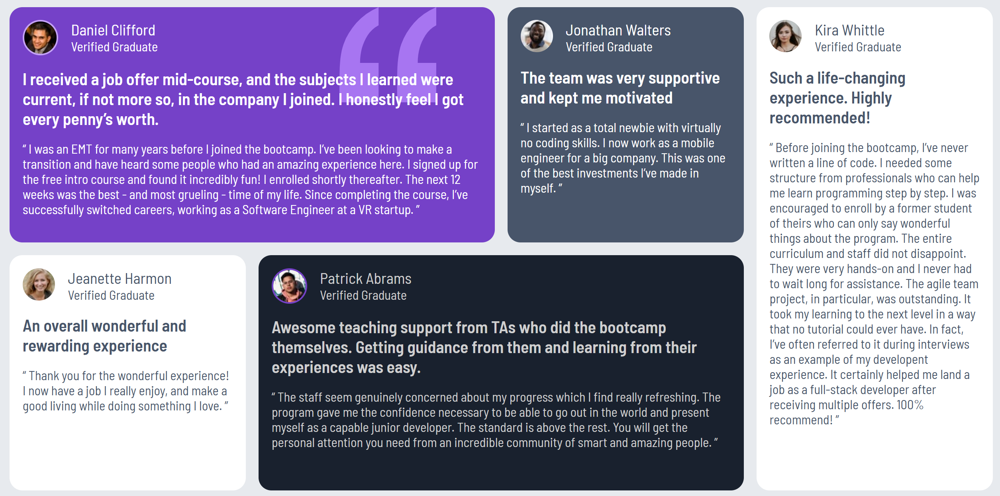

# Frontend Mentor - Testimonials grid section solution

This is a solution to the [Testimonials grid section challenge on Frontend Mentor](https://www.frontendmentor.io/challenges/testimonials-grid-section-Nnw6J7Un7). Frontend Mentor challenges help you improve your coding skills by building realistic projects. 

## Table of contents

- [Overview](#overview)
  - [The challenge](#the-challenge)
  - [Screenshot](#screenshot)
  - [Links](#links)
- [My process](#my-process)
  - [Built with](#built-with)
  - [What I learned](#what-i-learned)

## Overview

### The challenge

Users should be able to:

- View the optimal layout for the site depending on their device's screen size

### Screenshot



### Links

- Solution URL: [https://github.com/hrong1/testimonials-grid-section](https://github.com/hrong1/testimonials-grid-section)
- Live Site URL: [https://hrong1.github.io/testimonials-grid-section/](https://hrong1.github.io/testimonials-grid-section/)

## My process

### Built with

- Semantic HTML5 markup
- CSS custom properties
- Flexbox
- CSS Grid
- Mobile-first workflow

### What I learned

Get more understanding on the css grid, and learn about how to use background-image

```css
.card-container {
    display: grid;
    grid-template-columns: 1fr 1fr 1fr 1fr;
    grid-template-rows: 1fr 1fr;
    gap: 1rem;
}

.daniel {
    grid-column: 1 / 3;
    grid-row: 1;
    background-image: url('../images/bg-pattern-quotation.svg');
    background-position: 85% 0%;
    background-size: 20%; 
    background-repeat: no-repeat;
}

.jonathan {
    grid-column: 3;
    grid-row: 1;
}

.jeanette {
    grid-column: 1;
    grid-row: 2;
}

.kira {
    grid-column: 4;
    grid-row: 1 / 3;
}

.patrick {
    grid-column: 2 / 4;
    grid-row: 2;
}
```

